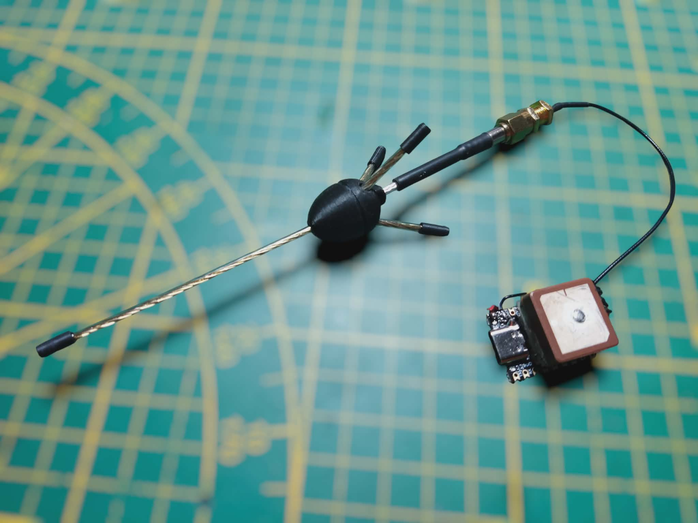
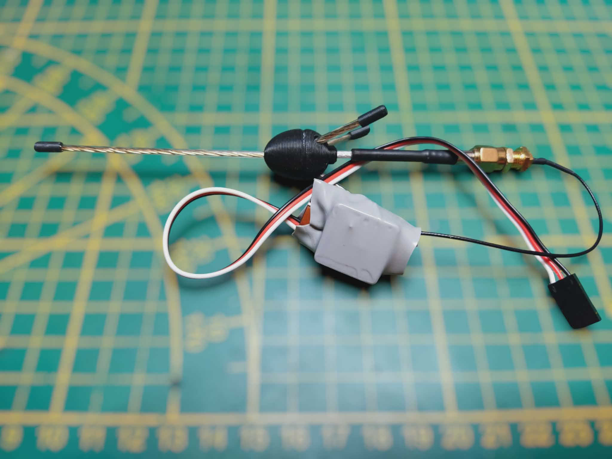
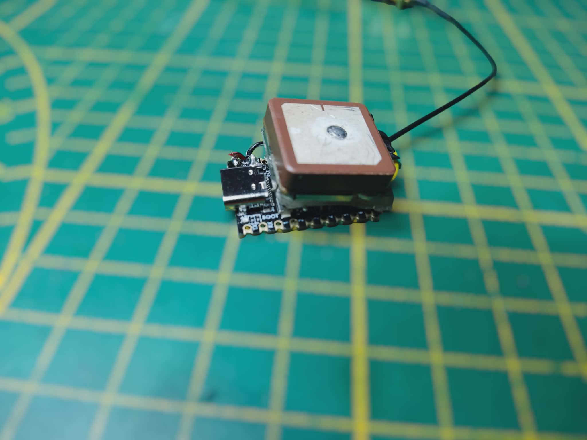
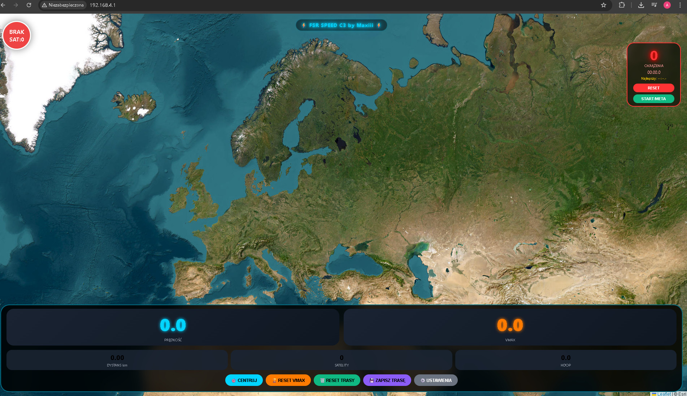
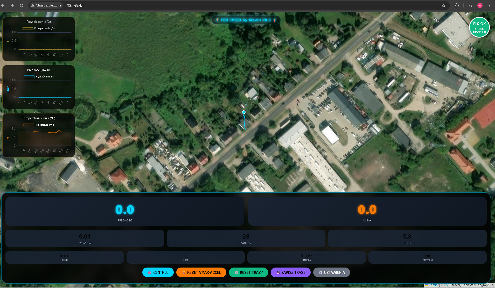
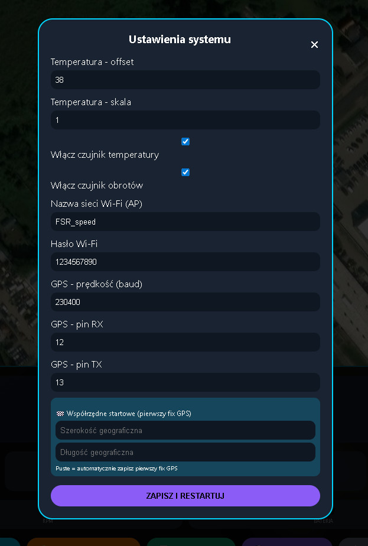
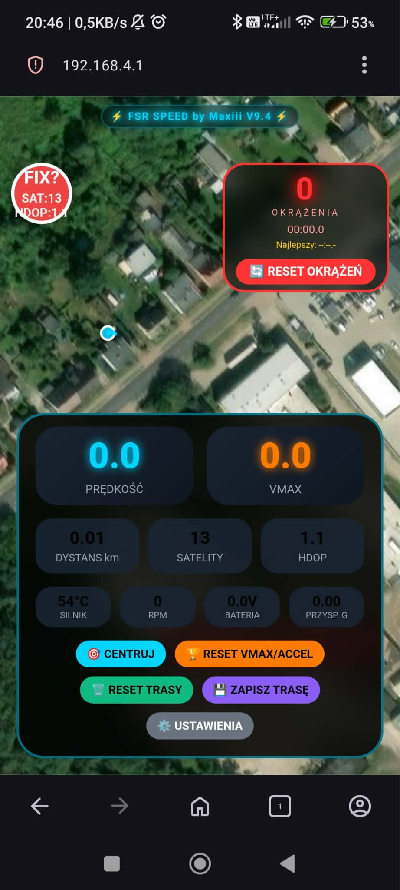

# FSR Speed Tracker v9.5

## Telemetria dla łodzi wyścigowych FSR

## Spis treści

1. [Opis ogólny](#opis-ogólny)
2. [Wersja ESP32-S3 (pełna)](#wersja-esp32-s3-pełna)
3. [Wersja ESP32-C3 (lekka)](#wersja-esp32-c3-lekka)
4. [Porównanie wersji](#porównanie-wersji)
5. [Budowa i podłączenia](#budowa-i-podłączenia)
6. [Instalacja oprogramowania](#instalacja-oprogramowania)
7. [Konfiguracja](#konfiguracja)
8. [Obsługa systemu](#obsługa-systemu)
9. [Funkcje zaawansowane](#funkcje-zaawansowane)
10. [Rozwiązywanie problemów](#rozwiązywanie-problemów)
11. [Dane techniczne](#dane-techniczne)

---

## Opis ogólny

System telemetrii dla łodzi wyścigowych **FSR** (Formuła Silnikowa Remote control) umożliwiający śledzenie parametrów pracy jednostki w czasie rzeczywistym. Urządzenie tworzy własną sieć Wi-Fi, do której można podłączyć telefon, tablet lub laptop, a następnie w przeglądarce internetowej obserwować:

- Pozycję łodzi na mapie satelitarnej
- Prędkość chwilową i maksymalną (VMAX)
- Przyspieszenie w jednostkach **G**
- Temperaturę silnika
- Obroty silnika (RPM)
- Napięcie baterii pokładowej
- Liczbę okrążeń z pomiarem czasu
- Przebyty dystans
- Trasę do zapisu w formacie **GPX**

System dostępny jest w dwóch wersjach sprzętowych.

---

## Wersja ESP32-S3 (pełna)

Pełna wersja oparta na **ESP32-S3 SuperMini** z PSRAM 2MB.

| Parametr | Wartość |
|----------|---------|
| Mikrokontroler | ESP32-S3 SuperMini (QFN56) |
| Pamięć Flash | 4 MB |
| Pamięć PSRAM | 2 MB (QSPI) |
| CPU | 240 MHz |
| Moduł GPS | HT1818Z3G5L z AT6558R (GPS+BDS, 10Hz) |
| Czujnik temp. | NTC 100kΩ (Beta=3950) |
| Czujnik obrotów | Hallotron 3144 |
| Pomiar napięcia | Dzielnik 2×100kΩ |
| Wi-Fi | 802.11b/g/n, kanał 1, moc 8.5–19.5 dBm |
| Zasięg Wi-Fi | do 300 m |
| Zasilanie | 5V lub 7.4V LiPo |
| Pobór prądu | ~350 mA |

**Funkcje:** wszystko (wykresy, regulacja mocy, zapis 6000 punktów).

---

## Wersja ESP32-C3 (lekka)

Uproszczona wersja na **ESP32-C3 SuperMini** (RISC-V).

| Parametr | Wartość |
|----------|---------|
| Mikrokontroler | ESP32-C3 SuperMini |
| Pamięć Flash | 4 MB |
| Pamięć RAM | 400 KB |
| CPU | 160 MHz |
| Moduł GPS | HT1818Z3G5L (10Hz) |
| Czujnik temp. | NTC 100kΩ (opcjonalnie) |
| Czujnik obrotów | brak (opcjonalnie) |
| Pomiar napięcia | brak |
| Wi-Fi | 802.11b/g/n, moc stała |
| Zasięg Wi-Fi | do 150 m |
| Zasilanie | 5V |
| Pobór prądu | ~200 mA |

**Funkcje:** podstawowe (prędkość, trasa, okrążenia, GPX). Brak wykresów i regulacji mocy.

---

## Porównanie wersji

| Cecha | ESP32-S3 | ESP32-C3 |
|-------|----------|----------|
| Cena zestawu | ~93 zł | ~50 zł |
| Pobór prądu | 350 mA | 200 mA |
| Zasięg Wi-Fi | do 300 m | do 150 m |
| Bufor trasy | 6000 pkt | 1000 pkt |
| Pamięć PSRAM | 2 MB | brak |
| Wykresy w UI | tak | nie |
| Regulacja mocy Wi-Fi | tak | nie |
| Pomiar temperatury | tak | opcjonalnie |
| Pomiar obrotów | tak | nie |
| Pomiar baterii | tak | nie |
| Czas zapisu trasy | ~60 min | ~10 min |

---

## Budowa i podłączenia

### Wspólne elementy

| Element | Model |
|---------|-------|
| ESP | ESP32-S3 lub ESP32-C3 SuperMini |
| GPS | HT1818Z3G5L z AT6558R |
| Antena GPS | GP 5/8 |
| Kondensator | 1000µF/6.3V |

### Podłączenia dla ESP32-S3

| Element | GPIO |
|---------|------|
| GPS TX → ESP RX | 12 |
| GPS RX ← ESP TX | 13 |
| Termistor NTC | 11 |
| Hallotron 3144 | 10 |
| Dzielnik baterii | 8 |

### Podłączenia dla ESP32-C3

| Element | GPIO |
|---------|------|
| GPS TX → ESP RX | 5 |
| GPS RX ← ESP TX | 6 |
| Termistor NTC | 2 (opcjonalnie) |
| Hallotron | 3 (opcjonalnie) |

### Schemat (ESP32-S3)
ESP32-S3 SuperMini
┌─────────────────┐
│ │
GPS TX ──────►│ GPIO12 (UART RX)│
GPS RX ◄──────│ GPIO13 (UART TX)│
│ │
3.3V ──[100kΩ]─┼─┬─[NTC]───┐ │
│ │ │ │
│ └─► GPIO11│ │
│ │ │
Hallotron ──────┼─► GPIO10 │ │
│ │ │
Bateria(+) ─[100kΩ]─┬─[100kΩ]─┐│
│ │ ││
│ └─► GPIO8││
│ ││
Bateria(-) ─────┴──────────┴┘
│
[1000µF/6.3V]
│
GND

---

## Instalacja oprogramowania

### Wymagania

- Arduino IDE 2.0+
- Zainstalowane wsparcie dla ESP32 (Board Manager)

### Instalacja ESP32 w Arduino IDE

1. **Plik → Preferencje** → dodaj URL:

2. 2. **Narzędzia → Płyta → Menadżer płyt** → zainstaluj `ESP32`

### Ustawienia dla ESP32-S3

| Ustawienie | Wartość |
|------------|---------|
| Board | ESP32S3 Dev Module |
| USB Mode | CDC (Native USB) |
| USB CDC On Boot | Enabled |
| CPU Frequency | 80 MHz |
| Flash Mode | DIO |
| Flash Size | 4MB (32Mb) |
| Partition Scheme | Default 4MB with spiffs |
| PSRAM | OPI PSRAM |
| Upload Speed | 921600 |

### Ustawienia dla ESP32-C3

| Ustawienie | Wartość |
|------------|---------|
| Board | ESP32C3 Dev Module |
| CPU Frequency | 160 MHz |
| Flash Mode | DIO |
| Flash Size | 4MB (32Mb) |
| Partition Scheme | Default 4MB with spiffs |
| Upload Speed | 921600 |

### Wgrywanie programu

1. Pobierz pliki: `fsr_speed_v95_ino.ino` i `html.h`
2. Umieść je w jednym katalogu
3. Otwórz `.ino` w Arduino IDE
4. Wybierz płytę i port COM
5. Kliknij **Wgraj**

---

## Konfiguracja

### Pierwsze uruchomienie

1. ESP32 utworzy sieć Wi-Fi `FSR_speed`
2. Połącz się hasłem `1234567890`
3. W przeglądarce wejdź na `http://192.168.4.1`
4. Poczekaj na FIX GPS (zielone kółko)

### Ustawienia w interfejsie

| Kategoria | Parametr | Domyślnie |
|-----------|----------|-----------|
| Temperatura | Offset | 38.0 |
| Temperatura | Skala | 1.0 |
| Wi-Fi | Moc nadajnika (S3) | 8.5 dBm |
| Wi-Fi | Tryb (S3) | n |
| Wi-Fi | SSID | FSR_speed |
| Wi-Fi | Hasło | 1234567890 |
| GPS | Baud | 230400 |
| GPS | Pin RX | 12 (S3) / 5 (C3) |
| GPS | Pin TX | 13 (S3) / 6 (C3) |

---

## Obsługa systemu

### Przyciski

| Przycisk | Funkcja |
|----------|---------|
| 🎯 CENTRUJ | Centruje mapę na łodzi |
| 🏆 RESET VMAX/ACCEL | Zeruje rekordy |
| 🗑️ RESET TRASY | Czyści trasę |
| 💾 ZAPISZ TRASĘ | Pobiera GPX |
| 🏁 USTAW LINIĘ START/META | Ustawia punkt start/meta |
| ⚙️ USTAWIENIA | Panel konfiguracji |

### Okrążenia

1. Ustaw punkt start/meta (przycisk na mapie)
2. System wykrywa wejście w promień 15 m
3. Liczy okrążenia i mierzy czasy
4. Zapamiętuje najlepszy czas

### Wizualizacja na mapie

| Element | Kolor |
|---------|-------|
| Aktualna pozycja | Niebieskie kółko |
| Trasa | Niebieska linia |
| VMAX | Pomarańczowa dymka |
| Max Accel | Złota dymka |
| Start/Meta | Czerwone kółko |

---

## Funkcje zaawansowane

### Wzory obliczeniowe

**Prędkość** – z NMEA RMC, filtr antydryf 3 km/h.

**Przyspieszenie**  
`a = (V_current - V_last) / dt`  
`G = a / 9.80665`

**Temperatura (NTC 100kΩ, Beta=3950)**  
`R = (100000 * V_adc) / (3.3 - V_adc)`  
`1/T = A + B*ln(R) + C*(ln(R))³`  
Stałe: A=0.001129148, B=0.000234125, C=0.0000000876741

**Obroty (RPM)**  
`RPM = (impulsy * 60000) / dt`

**Dystans** – wzór haversine, promień Ziemi 6371 km.

### Filtry

| Filtr | Wartość |
|-------|---------|
| Antydryf | 3 km/h |
| Mediana pozycji | 5 próbek |
| HDOP | < 2.0 |
| SAT | ≥ 4 |
| Dystans punktów | ≥ 0.5 m |

### Komendy GPS

| Komenda | Opis |
|---------|------|
| `$PMTK220,100*2F` | 10 Hz |
| `$PMTK314,0,1,0,1,...*28` | Tylko GGA i RMC |
| `$PMTK251,230400*...` | Zmiana baudrate |
| `$PMTK286,1*23` | Zapis do pamięci |

---

## Rozwiązywanie problemów

### Brak sieci Wi-Fi

- Sprawdź wybór płyty (ESP32S3 Dev Module)
- Naciśnij RESET po wgraniu
- Zmniejsz moc w ustawieniach (8.5 dBm)

### GPS nie ma FIX

- Zapewnij widok na niebo
- Sprawdź piny (TX→GPIO12, RX→GPIO13)
- Poczekaj 1-2 minuty

### Temperatura 0°C

- Włącz czujnik w ustawieniach
- Sprawdź połączenie termistora

### Brak RPM

- Włącz czujnik
- Ustaw magnes 2-5 mm od Hallotrona
- Sprawdź polaryzację (biegun N)

### Mały zasięg Wi-Fi (S3)

- Zwiększ moc do 19.5 dBm
- Ustaw tryb 802.11b
- Użyj anteny GP 5/8

---

## Dane techniczne

### ESP32-S3

| Parametr | Wartość |
|----------|---------|
| Procesor | Xtensa LX7 dual-core |
| Częstotliwość | 240 MHz |
| Flash | 4 MB |
| PSRAM | 2 MB |
| Wi-Fi | 802.11 b/g/n |
| GPIO | 18 |

### ESP32-C3

| Parametr | Wartość |
|----------|---------|
| Procesor | RISC-V single-core |
| Częstotliwość | 160 MHz |
| Flash | 4 MB |
| RAM | 400 KB |
| Wi-Fi | 802.11 b/g/n |
| GPIO | 14 |

### GPS HT1818Z3G5L

| Parametr | Wartość |
|----------|---------|
| Chip | AT6558R |
| Systemy | GPS + BDS |
| Częstotliwość | 10 Hz |
| Czułość | -165 dBm |
| Dokładność | 2.5 m |

### NTC 100kΩ

| Temp. | Rezystancja |
|-------|-------------|
| 0°C | ~327 kΩ |
| 25°C | 100 kΩ |
| 50°C | ~36 kΩ |
| 100°C | ~6.8 kΩ |
| 150°C | ~2.2 kΩ |

---

## Wersje oprogramowania

| Wersja | Data | Zmiany |
|--------|------|--------|
| v9.0 | 2025-01 | Podstawowa |
| v9.1 | 2025-02 | Autodetekcja GPS, 10Hz |
| v9.2 | 2025-03 | Wykresy po lewej, tryb mobilny |
| v9.3 | 2025-04 | Dymki VMAX/ACCEL |
| v9.4 | 2026-04 | Okrążenia, regulacja mocy Wi-Fi |
| v9.5 | 2026-04 | Wsparcie dla ESP32-C3 |

---
# FSR Speed ACC v0.9 – pomiar prędkości z dużą dokładnością przy wykorzystaniu ADXL345

System pomiaru prędkości, trasy i okrążeń dla łodzi FSR (Formuła Silnikowa RC).  
Łączy moduł GPS (AT6558R, 10Hz) z akcelerometrem ADXL345 (I2C) na platformie **ESP32-S3**.  
Dane są wyświetlane w czasie rzeczywistym na mapie satelitarnej przez przeglądarkę (Wi-Fi AP lub STA).  

---

## 🔧 Zastosowane filtry

| Filtr | Opis |
|-------|------|
| **Antydryf** | Odrzuca prędkości < 5 km/h (eliminacja szumów postojowych) |
| **Mediana prędkości** | 3-próbkowa mediana surowego odczytu GPS (szybka reakcja) |
| **Filtr Hampela** | Wykrywa i odrzuca pojedyncze outlier’y („szpilki”) w akcelerometrze |
| **Savitzky–Golay** | Wygładzanie oknem 7 próbek, zachowujące szczyty prędkości |
| **Butterworth (LPF)** | Dolnoprzepustowy 20 Hz – odcina drgania silnika (>50 Hz) |
| **Adaptacyjna fuzja GPS/ACC** | Dynamiczne ważenie sygnałów w zależności od HDOP i przyspieszenia |
| **Filtr Kalmana** | Optymalna estymacja prędkości z modelu szumów |
| **Mediana końcowa** | 10-próbkowa mediana przed wyświetleniem |

---

## 📡 Podłączenie (ESP32-S3 SuperMini)

| Komponent | GPIO |
|-----------|------|
| GPS TX → ESP RX | 12 |
| GPS RX ← ESP TX | 13 |
| ADXL345 SCL | 8 |
| ADXL345 SDA | 9 |
| Termistor NTC | 11 (przez 100kΩ do 3.3V) |
| Dzielnik baterii (2×100kΩ) | 10 |

> **Uwaga:** Piny 19 i 20 są zajęte przez native USB ESP32-S3.

---

## 📐 Sposób liczenia danych

### Prędkość
- Odczyt NMEA RMC (`gps.speed.kmph()`)
- Filtr antydryf i mediana 3 próbek
- Fuzja z akcelerometrem:  
  `v_fused = 0.7·v_gps + 0.3·(v_fused + ∫a·dt)`

### Przyspieszenie
- Akcelerometr ADXL345 (zakres ±16G)
- Kalibracja offsetów (przycisk w UI)
- Filtr Butterworth 20 Hz + Hampel

### VMAX (prędkość maksymalna)
- Rejestrowana tylko gdy **HDOP < 1.4** i **SAT ≥ 6**
- Zapisywana do historii (max 10 wartości, wyświetlane 4 ostatnie unikalne)

### Okrążenia
- Ustawienie linii start/meta przez przycisk na mapie
- Promień wykrywania: 15 m
- Mierzony czas okrążenia i najlepszy czas

### Dystans
- Wzór haversine (promień Ziemi 6371 km)
- Minimalna odległość między punktami trasy: 0.5 m

### Dokładność prędkości (wyświetlana jako `Dok: ±x.xxx km/h`)
Dokładność = 0.36 × K_sat × K_hdop × (1/√3)

text
- `0.36 km/h` – bazowa dokładność GPS AT6558R (0.1 m/s)
- `K_sat = 1 - (SAT-4)/30` (ograniczony do 0.3–1.0)
- `K_hdop = HDOP / 1.0` (ograniczony do 0.5–2.0)

Przykładowo: **SAT=20, HDOP=0.7** → dokładność ±0.068 km/h.

---

## 📊 Osiągane dokładności

| Warunki | SAT | HDOP | Dokładność statyczna | Błąd dystansu (40 km) |
|---------|-----|------|----------------------|------------------------|
| Optymalne (otwarta woda) | ≥20 | 0.3–0.6 | ±0.03–0.07 km/h | ±12–28 m |
| Dobre (małe fale) | 10–19 | 0.6–1.0 | ±0.07–0.15 km/h | ±28–60 m |
| Przeciętne | 6–9 | 1.0–1.4 | ±0.15–0.24 km/h | ±60–96 m |

> VMAX zapisywany tylko przy **SAT ≥ 6** i **HDOP < 1.4**.

---

## 🌐 Dostęp przez przeglądarkę

- **Tryb AP** (domyślnie): SSID `FSR_ACC`, hasło `12345678` → IP `192.168.4.1`
- **Tryb STA** (jeśli skonfigurowano): ESP32 łączy się z istniejącą siecią Wi-Fi
- **Nazwa lokalna:** `http://fsr.local` (mDNS)

---

## 📁 Struktura projektu
/
├── fsr_speed_acc.ino # kod główny
├── html_acc.h # strona główna (mapa, dane)
├── info.h # strona informacyjna
└── config.json # automatycznie tworzony plik konfiguracji

text

---

## ⚙️ Konfiguracja w Arduino IDE (ESP32-S3)

| Ustawienie | Wartość |
|------------|---------|
| Board | ESP32S3 Dev Module |
| USB Mode | CDC (Native USB) |
| CPU Frequency | 240 MHz |
| Flash Mode | QIO |
| Flash Size | 4MB (32Mb) |
| Partition Scheme | No OTA (2MB APP/2MB SPIFFS) |
| PSRAM | QSPI PSRAM |

---

## 🚤 Przykład użycia

1. Wgraj kod do ESP32-S3.
2. Połącz się z siecią `FSR_ACC` (hasło `12345678`).
3. Otwórz `http://fsr.local` lub `http://192.168.4.1`.
4. Zaczekaj na fix GPS (zielony wskaźnik).
5. Rozpocznij jazdę – na mapie pojawi się trasa, prędkość i okrążenia.
6. Aby ustawić linię start/meta – kliknij przycisk **🏁 USTAW START** w pozycji gdzie chcesz rozpocząć pomiar okrążeń.

---

## Licencja

Projekt open-source.

## Autorzy

**Maxiii** i **Deepseek**

---

**FSR Speed Tracker v9.5 – Profesjonalna telemetria dla Twojej łodzi wyścigowej** 🚤
